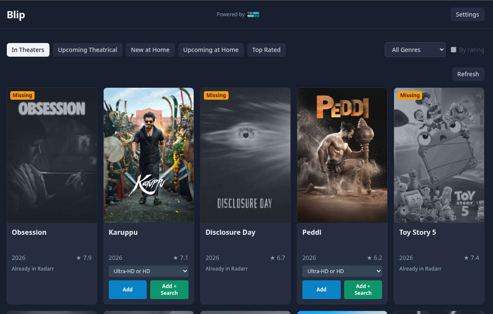

# Blip



Blip is a LAN-hosted movie discovery app for browsing movie lists and adding selected movies directly to Radarr.

## Features

- **Movie discovery** — browse TMDB lists: In Theaters, Upcoming, New at Home, Top Rated, and more
- **Genre filtering** — filter movies by genre with a dropdown
- **Title search** — find movies by name
- **Radarr integration** — see each movie's Radarr status (Missing, Downloaded, etc.) and add movies with one click
- **Add + Search** — add a movie to Radarr and immediately trigger a download search
- **Synopsis & trailers** — click a poster for details, watch trailers on YouTube
- **Scheduled backlog search** — periodically re-search for released movies still missing in Radarr
- **Settings page** — configure TMDB, Radarr, quality profiles, and root folders from the UI
- **Responsive design** — works on desktop, tablet, and phone
- **SQLite caching** — TMDB responses cached locally for fast loading
- **Docker ready** — single `docker run` or `docker compose up` to get started

Stack: Python 3.12+, FastAPI, SQLite, HTMX, Alpine.js, Tailwind CSS.

## Quick Start with Docker

The easiest way to run Blip is from the public Docker Hub image:

```bash
docker run -d --name blip -p 8080:8080 izno/blip:latest
```

Then open <http://localhost:8080/>

To use a different local port, map it to port `8080` inside the container:

```bash
docker run -d --name blip -p 3000:8080 izno/blip:latest
```

> Warning: these examples do not persist the app database outside the container. If the container is removed, local data is lost.
> To keep data between restarts, bind mount, use compose (example under) or use environment variables.

## Configuration

Blip can be configured in two ways:

1. **Environment variables** — set when starting the container
2. **Settings UI** — configure inside the app after it's running (overrides environment variables)

**Note:** All configuration is optional at startup. You can configure Blip entirely through the Settings UI once the app is running.

### Getting API Keys

**TMDB API Key** (free for private use):
1. Sign up for a free account at [themoviedb.org](https://www.themoviedb.org)
2. Go to Settings → API and request a key

**Radarr API Key**:
- Generated automatically when you install Radarr
- Found in Radarr Settings → General → API Key

### Environment Variables

Create a `.env` file in the project root (or pass variables to `docker compose`):

```env
# Optional: change the app's port (default 8080)
BLIP_PORT=8080

# TMDB (The Movie Database) integration
TMDB_API_KEY=your_tmdb_api_key

# Radarr integration
RADARR_BASE_URL=http://radarr:7878
RADARR_API_KEY=your_radarr_api_key
RADARR_DEFAULT_ROOT_FOLDER=/mnt/movies
RADARR_DEFAULT_QUALITY_PROFILE_ID=1
RADARR_DEFAULT_MINIMUM_AVAILABILITY=released
```

### Scheduled backlog search

Radarr only searches for a movie **at the moment you add it**. It does *not* go
back and re-check your existing library — a detail many people don't realise. So
a movie you added before any release existed will sit there missing forever
unless you remember to run *Search Missing Movies* yourself.

Blip can do that for you. On the **Settings** page, set **Scheduled backlog
search** to **Daily** or **Weekly** and Blip will trigger Radarr's
`MissingMoviesSearch` on that cadence (**Off** by default). Each run fires at a
*random time* within the period rather than a fixed instant — so if lots of
people run Blip, they don't all hit Radarr and the indexers at once. There's
also a **Run search now** button to trigger it on demand, plus a last-run /
next-run line so you can see it working.

This needs no extra setup beyond the Radarr connection above. To turn the
background job off entirely (e.g. for tests), set `SCHEDULER_ENABLED=false`.


## Docker Compose Example

```yaml
services:
  blip:
    image: izno/blip:latest
    ports:
      - "8080:8080"
    environment:
      TMDB_API_KEY: your_tmdb_api_key_here
      RADARR_BASE_URL: http://radarr:7878
      RADARR_API_KEY: your_radarr_api_key_here
    volumes:
      - blip-data:/app/data
    restart: unless-stopped

volumes:
  blip-data:
```

This example uses the public image `izno/blip:latest` from Docker Hub and stores the SQLite database in a named volume. That means data persists across container restarts and rebuilds.

If you want to override the image or build locally, update the `image` field or use `build: .` instead.

## Local Development

For local development with Python, see [docs/DEVELOPMENT.md](docs/DEVELOPMENT.md).

## Documentation

- [CLAUDE.md](CLAUDE.md) — Agent rules and "playbook"
- [AGANTS.md](CLAUDE.md) — Symlink of CLAUDE.md
- [docs/DEVELOPMENT.md](docs/DEVELOPMENT.md) — Local dev setup (venv)
- [docs/PRD.md](docs/PRD.md) — Product requirements and feature overview
- [docs/IMPLEMENTATION_PLAN.md](docs/IMPLEMENTATION_PLAN.md) — Milestone roadmap
- [docs/DECISIONS.md](docs/DECISIONS.md) — Architecture decision records
- [docs/ARCHIVES.md](docs/ARCHIVES.md) — Completed milestone details

